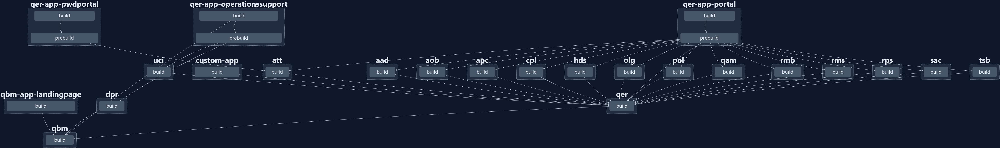

<h1 align="center">One Identity Manager HTML5 applications</h1>

<p align="center">
  
  <br>
  <em>One Identity open source projects are supported through GitHub issues and the One Identity Community. This includes all scripts, plugins, SDKs, modules, code snippets or other solutions. For assistance with any One Identity GitHub project, please raise a new Issue using our supported templates. You may also visit the One Identity Community to ask questions. Requests for assistance made through official One Identity Support will be referred back to GitHub and the One Identity Community forums where those requests can benefit all users.</em>
  <br>
</p>

<p align="center">
  <a href="https://www.oneidentity.com/"><strong>One Identity</strong></a>
  <br>
</p>

<p align="center">
  <a href="https://github.com/OneIdentity/IdentityManager.Imx/issues">Submit an Issue</a>
  ·
  <a href="https://www.oneidentity.com/community/">Community</a>
  ·
  <a href="https://support.oneidentity.com/">Support</a>
</p>

<hr>

- [About the repository](#about-the-repository)
- [Change log](#change-log)
- [Nx and Angular](#nx-and-angular)
- [Workspace overview](#workspace-overview)
  - [Angular libraries](#angular-libraries)
  - [Angular apps](#angular-apps)
- [Dependencies](#dependencies)
- [Debugging](#debugging)
- [Documentation](#documentation)
  - [Using npm only (recommended)](#using-npm-only-recommended)
  - [Using Compodoc](#using-compodoc)
- [Additional resources](#additional-resources)
- [Contributing](#contributing)
- [License](#license)

## About the repository

This repository contains the source code for the HTML5 applications contained in Identity Manager.

It is a monorepo containing the Angular [workspace](https://angular.io/guide/workspace-config), which consists of apps and [libraries](https://angular.io/guide/libraries).

We strongly recommend to read the [HTML Development Guide](https://support.oneidentity.com/technical-documents/identity-manager/9.3/html5-development-guide) before starting to work with the code in this repository.

By forking this repository, you may create customized versions of the projects and add them to your Identity Manager deployment.

## Change log

[Learn about the latest improvements](CHANGELOG.md).

## Nx and Angular

We currently support building projects via Angular directly or via the monorepo tool [Nx](https://nx.dev/getting-started/intro). All commands then can be run via either _ng_ for angular, and managed within the `angular.json` or _nx_ for nx, and managed within `nx.json` and the individual `projects/<project>/project.json`.

The advantage to using Nx is that dependency building and caching is handled for you, so running `nx build qer` will build qbm and then qer for you.

You can also see the depedency graph & tasks via `nx graph`:



## Workspace overview

Each Angular library and app belongs to a folder in the `projects` directory. The workspace is defined in the `angular.json` file.

### Angular libraries

| Name  | Type                   | Dependencies inside the workspace |
| ----- | ---------------------- | --------------------------------- |
| `aad` | Angular plugin library | `qbm`, `qer`                      |
| `aob` | Angular plugin library | `qbm`, `qer`                      |
| `apc` | Angular plugin library | `qbm`, `qer`                      |
| `att` | Angular plugin library | `qbm`, `qer`                      |
| `cpl` | Angular plugin library | `qbm`, `qer`                      |
| `dpr` | Angular plugin library | `qbm`                             |
| `hds` | Angular plugin library | `qbm`, `qer`                      |
| `olg` | Angular plugin library | `qbm`, `qer`                      |
| `pol` | Angular plugin library | `qbm`, `qer`                      |
| `qam` | Angular plugin library | `qbm`, `qer`                      |
| `qbm` | Angular library        | none                              |
| `qer` | Angular library        | `qbm`                             |
| `rmb` | Angular plugin library | `qbm`, `qer`                      |
| `rms` | Angular plugin library | `qbm`, `qer`                      |
| `rps` | Angular plugin library | `qbm`, `qer`                      |
| `sac` | Angular plugin library | `qbm`, `qer`                      |
| `tsb` | Angular plugin library | `qbm`, `qer`                      |
| `uci` | Angular plugin library | `qbm`, `qer`                      |

Each Angular library belongs to the Identity Manager module of the same name. You do not need to build Angular libraries for modules that are not part of your Identity Manager installation.

A (non-plugin) library acts like a regular compile-time dependency. A _plugin_ library is loaded dynamically at runtime, as determined by each plugin's `imx-plugin-config.json` file.

For more information about each project, see the `readme.md` files in each project's folder.

### Angular apps

| Name                        | Description                                       | Project type | Static dependencies |
| --------------------------- | ------------------------------------------------- | ------------ | ------------------- |
| `qbm-app-landingpage`       | API Server landing page and Server Administration | Angular app  | `qbm`               |
| `qer-app-portal`            | Portal                                            | Angular app  | `qbm`, `qer`        |
| `qer-app-operationssupport` | Operations Support Portal                         | Angular app  | `qbm`, `qer`        |
| `qer-app-pwdportal`         | Password Reset Portal                             | Angular app  | `qbm`, `qer`        |
| `custom-app`                | Template for custom applications                  | Angular app  | `qbm`               |

## Dependencies

Identity Manager 9.3 is based on Angular 18.

Verify that you have installed a compatible `node.js` version. The version used by the CI build is defined in the [`.github/workflows/npm-build.yml`](.github/workflows/npm-build.yml) file in the `node-version` property. Other versions of `node.js`, including newer versions, are not guaranteed to be compatible with other Angular versions. Please see the [version compatibility table](https://v18.angular.dev/reference/versions) on the official Angular site.

## Debugging

Running and debugging web applications is possible using the default tools of the Angular CLI toolchain. For example, you can use `ng serve qer-app-portal` to debug the Portal app.

You will need an API Server instance that the web applications will connect to. You can host an API Server locally for development purposes. Run the following command on the command line:

```
imxclient.exe run-apiserver -B
```

The web apps will connect to the API Server using the URL defined in the application's `environment.ts` file. The default setting is `http://localhost:8182` which is the default URL that a local API Server will run on.

## Documentation

Please refer to the [HTML Development Guide](https://support.oneidentity.com/technical-documents/identity-manager/9.3/html5-development-guide) for step-by-step instructions on getting started, building and deploying applications.

This repository also contains component-based documentation. There are two ways to install this documentation locally. The result will be stored in _imxweb/documentation/\<projectname>_.

### Using npm only (recommended)

1. Navigate to _imxweb_ and run `npm install` if you haven't already.
2. Build the documentation for any set of projects by running `npm run doc <projectname> <projectname2> ...`

### Using Compodoc

1. Install the Compodoc package globally by running `npm install -g @compodoc/compodoc`.
2. Navigate to the library to create documentation for (e.g. `imxweb\projects\qer`).
3. Run `compodoc -p tsconfig.lib.json` for a library or `compodoc -p tsconfig.app.json` for an application.

## Additional resources

- [Theming guide](./imxweb/custom-theme/readme.md)
- [CDR guide](./imxweb/projects/qbm/src/lib/cdr/Readme.md)
- [API Plugin Development](https://github.com/OneIdentity/IdentityManager.ApiSdk)
- [Upgrade guide](./UPGRADE.md)

## Contributing

We welcome and appreciate contributions. Here's how you can open a pull request to submit code changes.

1. Fork the project
2. Create your feature branch (`git checkout -b feature/AmazingFeature`)
3. Commit your changes (`git commit -m 'Add some AmazingFeature'`)
4. Push to the branch (`git push origin feature/AmazingFeature`)
5. Open a pull request

Due to the approach of syncing internal code with the github, these pull requests will be manually incorporated upstream and then a later sync will see this repo updated.

<!-- LICENSE -->

## License

Distributed under the One Identity - Open Source License. See [LICENSE](LICENSE) for more information.
